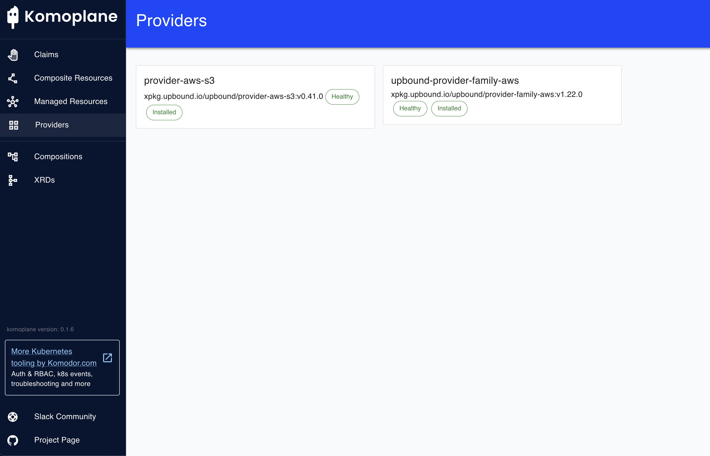
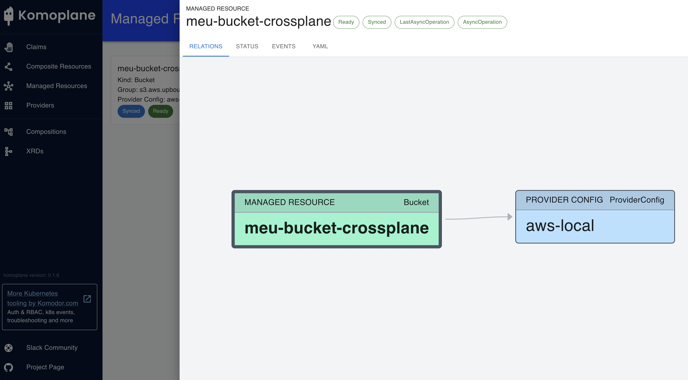

## 🧪 **Lab: Provisione um S3 com Crossplane e LocalStack no Kubernetes local — 100% offline e sem AWS**

Um **laboratório completo para rodar localmente** com as seguintes ferramentas:

* **[Kind](https://kind.sigs.k8s.io/):** Kubernetes local em containers Docker.
* **[Crossplane](https://crossplane.io/):** Provisão de infraestrutura com CRDs.
* **[Komoplane](https://komoplane.io/):** UI e dashboard para o Crossplane.
* **[LocalStack](https://localstack.cloud/):** Mock da AWS para testes locais.
* **[Docker](https://docs.docker.com/engine/install/):** Instalar Docker.
* **[kubectl](https://kubernetes.io/docs/tasks/tools/install-kubectl-linux/):** Instalar kubectl.
* * **[helm](https://helm.sh/docs/intro/install/):** Para instalação do KEDA como chart.
* **[aws-cli](https://docs.aws.amazon.com/cli/latest/userguide/getting-started-install.html):** Instalar aws-cli.
* Provisionamento de um **bucket S3** local usando o **Crossplane + LocalStack**.

---

### ✅ Pré-requisitos

Instale no seu ambiente:

- Docker
- kubectl
- helm
- kind
- awscli

---

## 🧪 Etapas do Lab

### 1. Subir cluster com Kind

```bash
kind create cluster --name crossplane-lab --config kind-cluster.yaml
```

---

### 2. Subir o LocalStack

```bash
localstack start
```

Isso iniciará o LocalStack com o serviço S3 disponível na url http://localhost:4566 do seu host local.

#### Atenção:  

#### Entre em outro terminal para continuar

Criar o aquivo de credencia e config:

```bash
aws configure
AWS Access Key ID [None]: fake 
AWS Secret Access Key [None]: fake
Default region name [None]: us-east-1
Default output format [None]: json
```

Verifique:

```bash
aws s3 mb s3://meu-bucket-teste --endpoint-url=http://localhost:4566
aws s3 ls --endpoint-url=http://localhost:4566
```

---

### 3. Instalar o Crossplane

```bash
helm repo add crossplane-stable https://charts.crossplane.io/stable
helm repo update

helm install crossplane crossplane-stable/crossplane --namespace crossplane-system --create-namespace
```

---

### 4. Instalar o Provider AWS S3 Crossplane

```bash
kubectl apply -f provider-aws-s3.yaml
```

Espere o pod do provider estar pronto:

```bash
kubectl get pods -n crossplane-system
```

---

### 5. Criar `ProviderConfig` para LocalStack (simulando AWS)

#### 5.1 Criar Secret com credenciais falsas

```bash
kubectl create secret generic aws-creds -n crossplane-system \
  --from-literal=creds="[default]
aws_access_key_id = test
aws_secret_access_key = test"
```

#### 5.2 Criar `ProviderConfig` para apontar ao LocalStack

```bash
kubectl apply -f providerconfig-localstack.yaml
```

---

### 6. Criar um bucket S3 com Crossplane

```bash
kubectl apply -f bucket.yaml
```

Verifique no LocalStack:

```bash
aws s3 ls --endpoint-url=http://localhost:4566
```

Você verá o bucket `meu-bucket-crossplane`.

---

### 7. (Opcional) Instalar o **Komoplane** – Dashboard para Crossplane

```bash
helm repo add komodorio https://helm-charts.komodor.io \
  && helm repo update komodorio \
  && helm upgrade --install komoplane komodorio/komoplane
```

Acesse o Komoplane:

```bash
kubectl port-forward svc/komoplane 8090:8090
```

Abra: [http://localhost:8090](http://localhost:8090)







---

## 🧪 Teste: Reconciliação automática do Crossplane (S3 Bucket)

### 1. ✅ Verifique o nome do bucket criado pelo Crossplane:

```bash
kubectl get buckets.s3.aws.upbound.io
```

Exemplo de saída:

```bash
NAME                    READY   SYNCED   EXTERNAL-NAME
meu-bucket-crossplane   True    True     meu-bucket-crossplane
```

---

### 2. 🧨 Delete o bucket manualmente dentro do LocalStack:

Use o cliente `aws`:

```bash
aws s3 rb s3://meu-bucket-crossplane --force  --endpoint-url=http://localhost:4566
```

> `--force` é necessário para remover mesmo que o bucket tenha conteúdo.

---

### 3. 👀 Observe a reconciliação pelo Crossplane:

Verifique os eventos do recurso:

```bash
kubectl describe bucket meu-bucket-crossplane
```

Você deverá ver eventos como:

```yaml
Events:
  Type     Reason          Age   From                                               Message
  ----     ------          ----  ----                                               -------
  Warning  ObserveError    ...   managed/bucket.s3.aws.upbound.io                  cannot find bucket...
  Normal   ExternalCreate  ...   managed/bucket.s3.aws.upbound.io                  successfully created external resource
```

Ou simplesmente observe o estado sincronizado:

```bash
kubectl get buckets.s3.aws.upbound.io
```

Em segundos, o campo `SYNCED` voltará para `True`, indicando que o Crossplane recriou o bucket automaticamente.

---

### 4. ✅ Valide no LocalStack que o bucket foi recriado:

```bash
aws s3 ls --endpoint-url=http://localhost:4566
```

Você verá novamente o bucket listado:

```
2025-06-09 15:42:12 meu-bucket-crossplane
```

---

Esse teste reforça como o **Crossplane atua como um controlador de estado desejado**, garantindo que a infraestrutura seja mantida conforme definido — mesmo diante de alterações manuais não autorizadas ou falhas.

---

### 🧼 Cleanup

```bash
kind delete cluster --name crossplane-lab
```
```bash
localstack stop
```

---

### ✅ Resultado Final

* Um **cluster local com Kind**.
* Um **mock da AWS com LocalStack**.
* **Infraestrutura criada com CRDs Crossplane**.
* Bucket S3 **totalmente local**.
* **Dashboard Komoplane** para visualização e controle.

---

### ✅ Conclusão

Neste lab, mostramos que é totalmente possível provisionar recursos da AWS — como buckets S3 — de forma **100% local**, utilizando ferramentas cloud native como:

* ✅ [Kind](https://kind.sigs.k8s.io/) para criar um cluster Kubernetes local e leve
* ✅ [Crossplane](https://crossplane.io/) para gerenciar infraestrutura como recursos Kubernetes
* ✅ [KomoPlane](https://github.com/komodorio/komoplane) como interface visual e leve para observar e interagir com recursos Crossplane
* ✅ [LocalStack](https://localstack.cloud/) para simular serviços da AWS sem necessidade de conta ou acesso à nuvem

Essa combinação de ferramentas permite criar ambientes de provisionamento de infraestrutura realista e eficiente **sem custos, sem dependência externa e com total controle local**. É uma solução ideal para desenvolvimento, testes, experimentação de infraestrutura-as-code e onboarding de times DevOps e de plataforma.

Durante a configuração, também enfrentamos e resolvemos desafios comuns como:

* Ajustes de endpoint customizado para S3 no LocalStack
* Configurações para evitar conflitos de DNS (como `hostnameImmutable`)
* Observabilidade da reconciliação dos recursos com o KomoPlane

O KomoPlane se mostrou especialmente útil para **visualizar em tempo real o estado dos recursos gerenciados**, simplificando a depuração e validação de configurações no ecossistema Crossplane.
